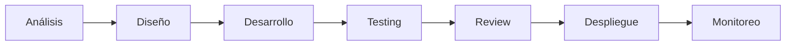

# Guía de Inicio Rápido

Esta guía te ayudará a comenzar rápidamente con el Sistema de Facturación Electrónica.

## 📋 Descripción

Sistema de automatización de facturación electrónica utilizando n8n, diseñado para gestionar procesos desde la especificación funcional hasta el despliegue.

## 🚀 Inicio Rápido

### 1. Clonar el Repositorio

```bash
git clone https://github.com/Stiven9710/R_Facturacion_Electronica.git
cd R_Facturacion_Electronica
```

### 2. Instalar Dependencias

```bash
# Instalar n8n globalmente
npm install -g n8n

# Instalar dependencias del proyecto
npm install
```

### 3. Configurar Ambiente

```bash
# Copiar template de configuración
cp src/config/.env.template .env

# Editar .env con tus configuraciones
nano .env
```

### 4. Iniciar n8n

```bash
# Iniciar n8n
npm start

# O en modo desarrollo con tunnel
npm run dev
```

Acceder a n8n en: http://localhost:5678

## 📁 Estructura del Proyecto

```
R_Facturacion_Electronica/
├── docs/                    # 📚 Documentación completa
│   ├── especificaciones/    # Especificaciones funcionales
│   ├── tecnicas/           # Documentación técnica
│   ├── manuales/           # Guías y manuales
│   └── api/                # Documentación de APIs
│
├── src/                    # 💻 Código fuente
│   ├── workflows/          # Workflows de n8n (archivos .json)
│   ├── custom-nodes/       # Nodos personalizados
│   ├── scripts/            # Scripts de automatización
│   └── config/             # Configuraciones
│
├── tests/                  # ✅ Pruebas
│   ├── unit/               # Pruebas unitarias
│   ├── integration/        # Pruebas de integración
│   └── e2e/                # Pruebas end-to-end
│
├── deploy/                 # 🚢 Configuraciones de despliegue
│   ├── development/        # Ambiente de desarrollo
│   ├── staging/            # Ambiente de staging
│   └── production/         # Ambiente de producción
│
├── gestion/                # 📊 Gestión del proyecto
│   ├── procesos/           # Metodología y procesos
│   ├── componentes/        # Registro de componentes
│   └── seguimiento/        # Tracking y métricas
│
└── assets/                 # 🎨 Recursos
    ├── images/             # Imágenes y diagramas
    └── templates/          # Plantillas reutilizables
```

## 🎯 Primeros Pasos

### Para Desarrolladores

1. **Leer la metodología**:
   ```bash
   cat gestion/procesos/metodologia.md
   ```

2. **Revisar workflows existentes**:
   ```bash
   ls src/workflows/
   ```

3. **Crear un nuevo workflow**:
   - Ir a n8n: http://localhost:5678
   - Crear nuevo workflow
   - Desarrollar y probar
   - Exportar a `src/workflows/`

4. **Documentar el componente**:
   - Especificación: `docs/especificaciones/`
   - Técnica: `docs/tecnicas/`
   - Registrar en: `gestion/componentes/registro.md`

### Para Gestión de Proyecto

1. **Revisar componentes registrados**:
   ```bash
   cat gestion/componentes/registro.md
   ```

2. **Consultar metodología**:
   ```bash
   cat gestion/procesos/metodologia.md
   ```

3. **Ver roadmap**:
   - Revisar `gestion/componentes/registro.md` (sección Roadmap)

### Para Documentación

1. **Usar templates**:
   - Funcional: `docs/especificaciones/TEMPLATE_especificacion_funcional.md`
   - Técnica: `docs/tecnicas/TEMPLATE_documentacion_tecnica.md`

2. **Seguir convenciones**:
   - Leer `CONTRIBUTING.md` para estándares

## 🛠️ Comandos Útiles

### Desarrollo
```bash
npm start              # Iniciar n8n
npm run dev            # Iniciar con tunnel
npm test               # Ejecutar tests
npm run lint           # Linting de código
```

### Workflows
```bash
npm run export:workflows    # Exportar todos los workflows
npm run import:workflows    # Importar workflows
```

### Utilidades
```bash
npm run backup              # Crear backup
npm run validate:config     # Validar configuración
```

## 📖 Documentación Clave

### Debe Leer

1. **[README.md](README.md)** - Visión general del proyecto
2. **[CONTRIBUTING.md](CONTRIBUTING.md)** - Guía de contribución
3. **[gestion/procesos/metodologia.md](gestion/procesos/metodologia.md)** - Metodología de trabajo

### Documentación Técnica

1. **[docs/manuales/guia_despliegue.md](docs/manuales/guia_despliegue.md)** - Guía de despliegue
2. **[src/workflows/README.md](src/workflows/README.md)** - Workflows
3. **[src/config/README.md](src/config/README.md)** - Configuración

### Templates

1. **[docs/especificaciones/TEMPLATE_especificacion_funcional.md](docs/especificaciones/TEMPLATE_especificacion_funcional.md)**
2. **[docs/tecnicas/TEMPLATE_documentacion_tecnica.md](docs/tecnicas/TEMPLATE_documentacion_tecnica.md)**

## 🔄 Flujo de Trabajo Típico

### 1. Crear Nueva Funcionalidad

```bash
# 1. Crear branch
git checkout -b feature/nombre-feature

# 2. Desarrollar workflow en n8n
# 3. Exportar workflow
# 4. Documentar

# 5. Agregar tests
npm test

# 6. Commit
git add .
git commit -m "feat: descripción del cambio"

# 7. Push y crear PR
git push origin feature/nombre-feature
```

### 2. Workflow Completo



1. **Análisis**: Crear especificación funcional
2. **Diseño**: Crear documentación técnica
3. **Desarrollo**: Implementar en n8n
4. **Testing**: Ejecutar tests
5. **Review**: Code review
6. **Despliegue**: Deploy a staging/producción
7. **Monitoreo**: Verificar ejecución

## 🆘 Ayuda y Soporte

### Problemas Comunes

**n8n no inicia**:
```bash
# Verificar puerto
netstat -tulpn | grep 5678
# Limpiar y reiniciar
rm -rf ~/.n8n/cache
n8n start
```

**Workflow no se importa**:
```bash
# Verificar formato JSON
cat src/workflows/workflow.json | jq .
```

**Tests fallan**:
```bash
# Limpiar y reinstalar
rm -rf node_modules
npm install
npm test
```

### Recursos

- **Documentación n8n**: https://docs.n8n.io/
- **Issues**: https://github.com/Stiven9710/R_Facturacion_Electronica/issues
- **Discusiones**: https://github.com/Stiven9710/R_Facturacion_Electronica/discussions

## 📝 Checklist para Nuevos Miembros

- [ ] Clonar repositorio
- [ ] Configurar ambiente local
- [ ] Leer README.md
- [ ] Leer CONTRIBUTING.md
- [ ] Leer metodología (gestion/procesos/metodologia.md)
- [ ] Configurar n8n localmente
- [ ] Importar workflows de ejemplo
- [ ] Ejecutar tests
- [ ] Hacer primer commit de prueba

## 🎓 Siguientes Pasos

1. **Explorar workflows existentes** en `src/workflows/`
2. **Revisar documentación** en `docs/`
3. **Estudiar la metodología** en `gestion/procesos/`
4. **Configurar ambiente** según `docs/manuales/guia_despliegue.md`
5. **Crear primer workflow** siguiendo las guías
6. **Documentar el workflow** usando templates
7. **Hacer primera contribución** siguiendo `CONTRIBUTING.md`

## 📞 Contacto

- **Repositorio**: https://github.com/Stiven9710/R_Facturacion_Electronica
- **Issues**: Para reportar bugs o solicitar features
- **Discussions**: Para preguntas generales

---

¡Bienvenido al equipo! 🎉

Para más detalles, consulta el [README.md](README.md) principal.
